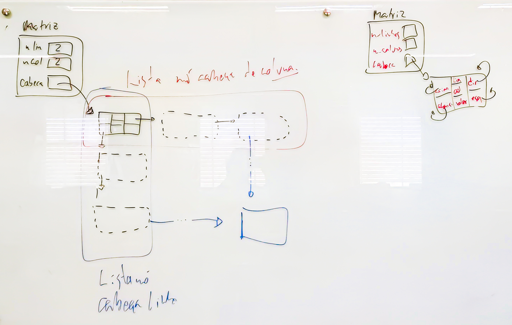

# Lab04: Matriz Esparsa

Implemente com matriz esparsa (sem desperdício acima do proporcional ao número de elementos da matriz) as funções sobre matrizes esparsar descritas no arquivo .h.

```
  Matriz
___________
| n_lin 1 |
| n_col 1 |
| cabeca \|
----------\   cab. dos cab.        (cab das colunas)
           \ _____________          _____________
            |   |     | .--------> |   |     | .--> cab dos cab
            |___|     |___|        |___|     |___|
            | . |     |   |        | . |     |   |
            |_|_|_____|___|        |_|_|_____|___|
              |                      |
              |                      |
              V                      |
            (cab das linhas)         V
             _____________          _____________
            |   |     | .--------->|   | lin | .---------> cab das linhas
            |___|     |___|        |___| col |___|
            | . |     |   |        |   | val |   |
            |_|_|_____|___|        |_|_|_____|___|
              |                     |
              |                     |
              V                     V
         cab dos cab           cab das col
```

